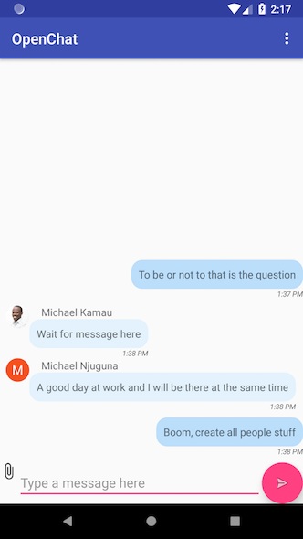

# OpenChat

This is a sample chat application that I am currently using to explore concepts in the  Android SDK.

The goal of OpenChat is to make me a better Android developer who uses best practices in design, architecture
and coding :smile:. Here are some of the features to expect:

* Authentication via providers such as Google, Facebook, Github, e.t.c as well as email/phone number combination with password
* Public and private channels. Private channels will allow one on one chat between chat participants
* Sending and receiving of file attachments
* Chat notifications

## Current state of the application

Features Implemented:
  * Authentication via Google
  * Messages sync via Firebase Realtime Database
  * Single public channel 
  * Sending of notifications to devices via Firebase Cloud Messaging
  
Sample screenshot:

    